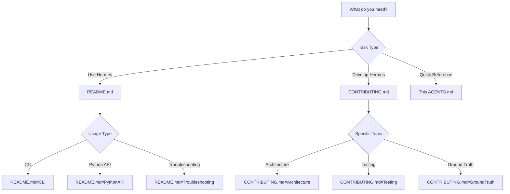

# HERMES Agent Guidance

**Priority reading for AI agents working with this codebase.**

## Hermes 1.x Development Rules

The `feature/hermes-1.0-loop-core` branch is the active 1.x development line.
Do not commit 1.x work directly to `main`. The 0.0.x approval, daemon, and UI
automation modules remain reference material until a 1.x replacement is
independently validated.

### Product Boundary

Hermes stimulates the right existing VS Code agent at the right time with the
right message while getting out of the human's way. The initial 1.x contract is
only an interval plus a message, followed by a bounded wake attempt. Keep the
scheduler, target identity, safety policy, and platform delivery separate.

### Human-Safety Requirements

1. Never activate or foreground a window to deliver a wake.
2. Never type into the user's foreground window or shared keyboard focus.
3. Never open a visible terminal as part of normal background operation.
4. Refuse delivery when the target is ambiguous, unverified, foreground-owned,
   or marked as receiving human input.
5. Do not claim ambient behavior unless it works while the user is actively
   using VS Code.

Platform adapters must fail closed when they cannot prove the target and the
delivery channel are safe. A skipped wake is preferable to a wrong-window
message or stolen focus.

### Shell and Task Portability

Every executable script and validation command must run in PowerShell, Git Bash,
and a VS Code task terminal. Prefer `python` over `python3` on Windows and use
relative repository paths in task arguments. Validate task execution separately
from direct shell execution. Do not use `node -e`, heredoc programs, or other
inline application code; create a real script or test file instead.

### Validation Gate

Before committing 1.x work:

```text
npm run test:v1
python -m pytest tests/ -m "not requires_vscode" -q
git -c core.whitespace=cr-at-eol diff --check
```

Tests must cover the pure decision boundary before any live Windows UI test is
added. Live UI tests must be opt-in and must never run as part of the default
test command.

## Quick Start Guide  

**If you are:**

### 🔧 **Implementing a new feature** → Read [CONTRIBUTING.md](CONTRIBUTING.md)
- Architecture overview
- Development workflow with feature branches
- Code review process
- Testing requirements

### 📖 **Using Hermes to detect/approve agent requests** → Read [README.md](README.md)
- Installation instructions
- Usage examples
- API documentation  
- Configuration options

###  🐛 **Debugging an issue** → Start here
1. Check if tests are passing: `python3 -m pytest tests/`
2. Review [README.md#Troubleshooting](README.md#troubleshooting) for common issues
3. Check ground truth identifiers in [vscode_ground_truth.py](vscode_ground_truth.py)
4. If VSCode updated recently, see [CONTRIBUTING.md#CrossVersionTesting](CONTRIBUTING.md#cross-version-testing)

### 🔍 **Understanding the codebase** → Essential knowledge

**Core Philosophy:**
- **100% ground truth driven**: All identifiers extracted from VSCode source code
- **Pure functional**:  All functions deterministic with no side effects
- **Modular architecture**: Clear separation of concerns
- **Version resilient**: Stable identifiers that work across VSCode versions

**Project Structure:**
```
hermes/
├── vscode_ground_truth.py        # 🎯 Source of truth - all VSCode identifiers
├── core/                          # Pure function modules
│   ├── data_models/              # Immutable data structures
│   ├── parsers/                  # Text parsing functions
│   └── ui_automation/            # UI interaction functions
├── detection.py                   # 📡 Public API - detect paused agents
├── approval.py                    # ✅ Public API - approve/skip agents
├── tests/                         # Test suite
└── docs/                          # Additional documentation
```

**Key Files by Concern:**

| Concern | Files | Purpose |
|---------|-------|---------|
| **Ground Truth** | [vscode_ground_truth.py](vscode_ground_truth.py) | All VSCode identifiers with source citations |
| **Data Models** | [core/data_models/](core/data_models/) | Immutable structures for requests/windows/elements |
| **Parsing** | [core/parsers/](core/parsers/) | Extract data from VSCode UI text |
| **UI Detection** | [core/ui_automation/](core/ui_automation/) | Find windows/elements using ground truth |
| **Public API** | [detection.py](detection.py), [approval.py](approval.py) | Declarative wrappers for end users |

**Testing Philosophy:**
- Test pure functions with property-based tests (hypothesis)
- Test ground truth identifiers against multiple VSCode versions
- Integration tests verify full detection → approval workflow

**Common Tasks Quick Reference:**

```python
# Find paused agents
from hermes import detection
agents = detection.find_paused_agents()

# Approve an agent
from hermes import approval  
approval.approve_agent(agent.window_handle)

# Get ground truth constant
from hermes import vscode_ground_truth as gt
action_id = gt.ACCEPT_TOOL_CONFIRMATION_ACTION_ID
```

## Decision Tree for Documentation



## Ground Truth Update Workflow

**When VSCode updates and identifiers break:**

1. **Verify the Break**:
   ```bash
   python3 tests/test_vscode_versions.py
   ```

2. **Find New Identifiers**:
   - Clone/update [microsoft/v scode](https://github.com/microsoft/vscode)
   - Search for changed identifiers in `src/vs/workbench/contrib/chat/`
   - Document new line numbers and file paths

3. **Update Ground Truth**:
   - Edit [vscode_ground_truth.py](vscode_ground_truth.py)
   - Update citations with new line numbers
   - Add version compatibility notes

4. **Test Across Versions**:
   ```bash
   python3 tests/test_cross_version_compatibility.py
   ```

5. **Document Changes**:
   - Update [CHANGELOG.md](CHANGELOG.md)
   - Update [VERSION_COMPATIBILITY](vscode_ground_truth.py#L231) dict

## Development Principles

### ✅ **DO**
- Extract ALL identifiers to `vscode_ground_truth.py` with citations
- Write pure functions (same input → same output)
- Use frozen dataclasses for immutability
- Parameterize everything (no magic strings/numbers)
- Test against multiple VSCode versions
- Document source code references for every constant

### ❌ **DON'T**  
- Hardcode button text/class names in business logic
- Create functions with side effects
- Assume VSCode UI structure without source verification  
- Skip cross-version testing
- Commit untested code
- Use monolithic functions (keep them small and composable)

## Emergency Contacts

**If Hermes stops working:**
1. Check if VSCode updated: `code-insiders --version`
2. Run diagnostic: `python3 hermes_diagnostic.py`
3. Check GitHub issues: https://github.com/VGM9/hermes/issues
4. Review recent commits: `git log --oneline -10`

**For urgent VSCode breakage:**
- Revert to last known working version
- File issue with VSCode version number and error
- Check [vscode_ground_truth.py#VERSION_COMPATIBILITY](vscode_ground_truth.py#VERSION_COMPATIBILITY) for tested versions

---

**Last Updated**: 2026-02-04  
**Maintainer**: Theca.0.0.Q  
**Code Review Score**: 9.5/10 ✅
